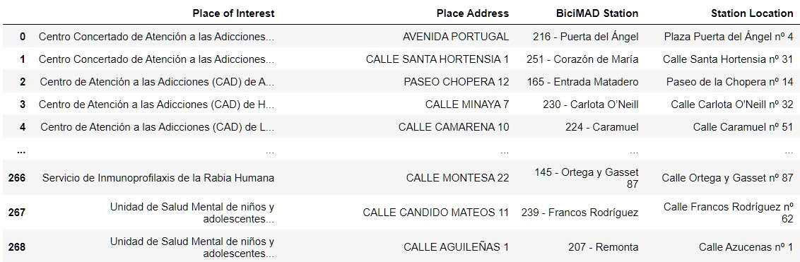

# Proyecto Módulo 1

El objetivo de este proyecto es la creación de una tabla que nos devuelva la estación de BiciMAD más cercana a cada Centro Médico de la Comunidad de Madrid; o bien la estación BiciMAD más cercana a un centro médico que introduzca el usuario. 

## Requeriments y Librerías Usadas

- Python 3.9.12
- sqlalchemy - Para el acceso a la base de datos de BiciMAD
- requests - Para el acceso a los datos de los centros de atención médica del ayuntamiento de Madrid
- pandas
- argparse
- geopandas & shapely.geometry - Para el cálculo de distancias
- fuzzywuzzy - Para mejorar y facilitar la experiencia del usuario
- folium - Para generar mapas

## Módulos

El proyecto consta de 4 módulos y el script principal. Los 4 módulos son los siguientes:

### connections.py

Incluye las dos funciones necesarias para la recogida de datos. 

- bicimad_connection: conecta con la base de datos de bicimad, devuelve una tabla de 
- centros_atencion_medica: conecta con los datos de los centros de atención médica de Madrid. Devuelve una tabla de pandas

### geo_calculations.py

Incluye las dos funciones que calcularán las distancias reales entre dos puntos de coordenadas que reciban.

- to_mercator: recibe una coordenada de latitud y otra de longitud. Transforma el par latitud-longitud que recibe a un par  equivalente en un plano. Es utilizada por la función distance_meters
- distance_meters: recibe dos pares de coordenadas(4 floats). Calcula la distancia entre dos pares de coordenadas que recibe. Devuelve un float.

### points_and_distances.py

Incluye las funciones necesarias para obtener la distancia entre un centro y la parada más cercana a ese centro.

- start_points: recibe el dataframe de los centros. Devuelve un list de tuplas. Cada tupla es un par de coordenadas que representa cada centro médico.
- finish_points: recibe el dataframe de las paradas de BiciMAD. Devuleve un list de tuplas donde cada tupla es un par de coordenadas que representa cada parada.
- min_distance: recibe un start_point y el list con todos los finish_points. Calcula el par de coordenadas cuya distancia al start_point que recibe es la menor. Devuelve una tupla formada por ese par de distancia óptima y la distancia calculada.

### main_table.py

Consta de dos funciones que se encargan de crear la tabla principal y otra con 5 columnas más que corresponden a las coordenadas de cada parada y cada centro; y las distancias entre ellos.

- main_table_with_extras: recibe el dataframe de los centros, una lista con sus coordenadas, un dataframe de las paradas, una lista con sus coordenadas y las distancias.
- main_table: recibe la tabla con los extras. Devuelve un dataframe con las columnas pedidas.

### map_generator.py

Este módulo tiene una función que se encargará de generar un mapa en código html con los puntos de la parada y el centro buscados por el usuario. 

map_generator: recibe las coordenadas y los nombres del centro y de la parada. Devuelve un True y genera en el directorio principal un archivo html que contiene el mapa.

## main.py

El script principal llama a los módulos anteriores, formando un pipeline que comienza con la introducción de la base de datos de BiciMAD y el dataset de centros de atención médica del ayuntamiento de Madrid, extraído de la web del ayuntamiento (https://datos.madrid.es/egob/catalogo/212769-0-atencion-medica.json). El script termina con la devolución de, o bien una tabla con todos los registros de cada centro junto a su parada de BiciMAD más cercana, o bien el registro del centro junto a su parada introducido por el usuario. 

Mediante Argparse tenemos dos opciones de ejecución del script. La primera devuelve, en el caso de que introduzcamos "all", una tabla con todas los centros y paradas cercanas la cual se guarda en un archivo .csv en la carpeta /data del directorio principal. La segunda se ejecuta introduciendo el nombre de un centro concreto. Devuelve una tabla con ese registro encontrado en .csv en la misma carpeta /data; y un mapa en html con la ubicación del centro y de la parada.

### Mejoras añadidas

El script incorpora una mejora para que en el caso de escribir mal el centro buscado sea capaz de encontrar el centro al que se quiere hacer referencia. Esto es posible gracias a la librería FuzzyWuzzy, con la que se ha creado una función (fuzzywuzzy_implementation) que recibe el string introducido por el usuario y busca una coincidencia en la tabla principal, devolviendo el string bien escrito.

El pipeline tambien es capaz de generar un mapa en código html con la ubicación del centro y de la parada en el caso de que busquemos un centro concreto.

## Pain Points:

- velocidad de cálculo de distancias. El primer método tardaba demasiada .
- hubo un problema con la función de generar mapa. La función creaba un mapa con unos puntos de coordenadas que no se correspondían con los introducidos por el usuario a pesar de que en el dataframe que en un principio recibía ese registro ya no existía. La solución temporal aportada por el profesor consiste en extraer los datos necesarios y mandárselos a la función en lugar de mandar un dataframe. 
 